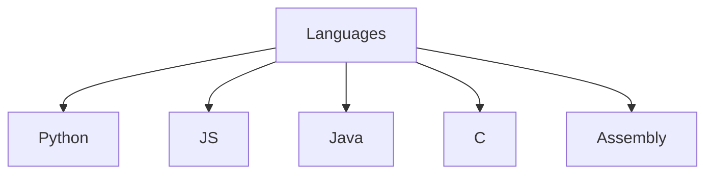

  <h1>Hi buddy 😁</h2>

  
  

  
  
  

<h3> 
My name is Basheer Rjoub.
</h3>

 
I'm a web developer from Palestine, currently a CSE students who has some passion towards computers regarding both the HW & SW.

 
 
 
<h3> 
Expertise
</h3>

-  Good knowledge of HTML, CSS, SCSS and JS

-  Worked previously with VueJS with NodeJS in an internship

-  Excellent Knowledge of DJango, DJango Rest, SQLite and Postgress.

-  Deployment on Heroku and Deployment management.

-  Learning More Technologies such as Docker, GraphQL and React.

  &nbsp;
  &nbsp;
  &nbsp;
  &nbsp;
  &nbsp;
  

---

### :fire: Stats :

